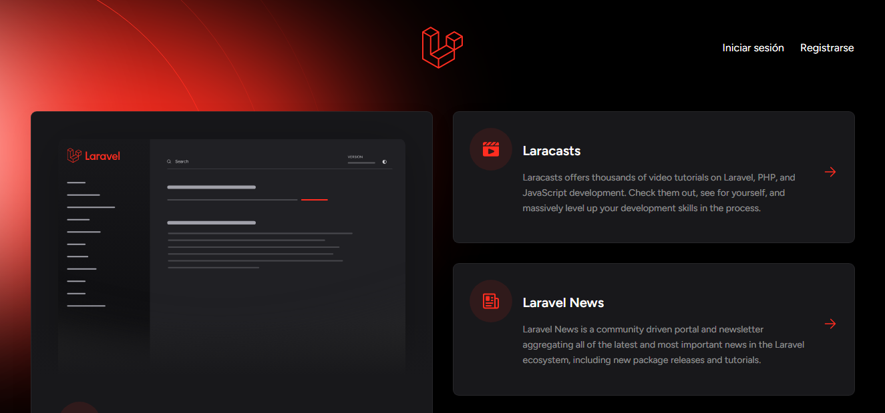
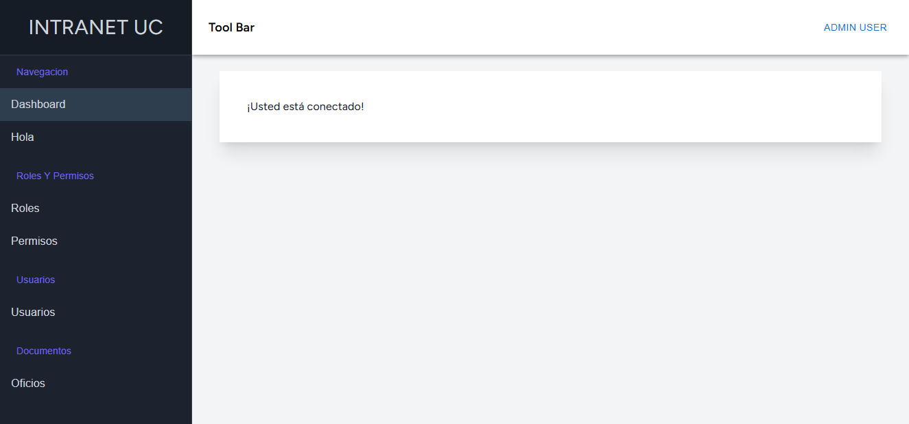
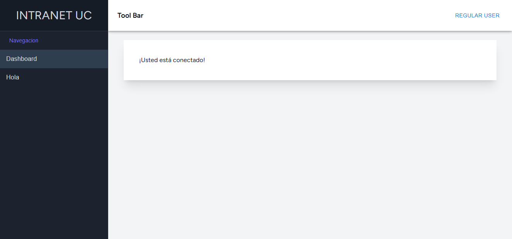

# Guia para desarrolladores

al abrir la aplicacion veran esta pantalla (aun en desarrollo)



una ves en esta vista pueden iniciar sesión o registrarse

si desan iniciar sesion podran encontrar una credeciales por defecto en la capeta: database > seeders > databseSeeder.php
hay podran encontrar dos usuarios uno **regular** y uno **administrador** , la contraseña por defecto de cada uno es 'password'.

---

iniciado sesión podrán encontrar la vista de interna de la aplicación

Admin:



Regular:


---

# Layout

el layout de la aplicación lo podrán encontrar en : resources > js > layouts > AdminLayout.jsx
son libres de hacer sus propios layouts si es necesario o modificar el existente

---

# menu de navegacion

los elementos del menu de navegacion lo encuentran en : resources > js > \_partials > AsideDrawer > DrawerRoutesList.js
podran agregar o quitar rutas siguiendo la siguiente estructura:

```javascript
{
    permissionNeeded: "Permiso de usuario necesario" | null ("ruta publica"),
    subHeaderText: "nombre de la seccion del menu",
    routes: [
        {
            linkText: "texto del boton, ruta 1",
            routeName: "nombre de la ruta 1 en routes > web.php",
        },
        {
            linkText: "texto del boton, ruta 2",
            routeName: "nombre de la ruta 2 en routes > web.php",
        },
        ...
    ],
},
```

---

# Localizacion

se uso i18n agregar diferentes idiomas a la aplicacion y tambien para la centralizacion de los texto de la aplicacion,
las traducciones se pueden encontrar en : resources > js > i18n > locales > (idioma) > traduccion.json
